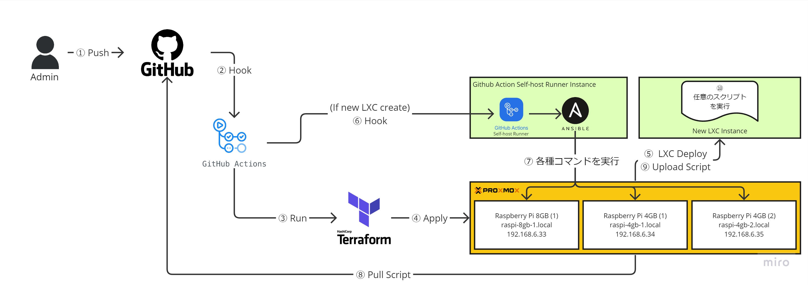

# Github Action Self-host Runner And Ansible Setup

## サービスの仕様

このサービスは Github Action Self-host Runner を用いることで、内部環境に対して CI/CD を実施できるようにするものです。

Kubernetes を LXC で起動するためには、Proxmox 内に設置されるコンテナの設定ファイル（`/etc/pve/lxc/<コンテナID>.conf`）を書き換える必要があります。

それらを自動化するために、Github Action からコンテナを作成した際に上記作業を実行できる環境を作成します。

よって以下の仕様とします。

[最新の構成図](https://miro.com/app/board/uXjVOnZ07F0=/?moveToWidget=3458764559949216999&cot=14)



- このサービスは外部に公開しない。
- このインスタンスは冗長は特に要求しない。
- 本サービスでは以下のアプリケーションを稼働させる。
  - `github action self-host runner`: Github Action とコネクションを張り、ジョブからコマンドが実行されたら同環境にてコマンドを実行する役割を担う。
  - `ansible`: 他の複数のホストに対して SSH 経由でコマンドを実行する役割を担う。
- アプリケーション間またはホスト間の通信がややこしいので Docker は使用しない。

## LXC の起動

Terraform で作成します。**事前に `/proxmox` 内の Terraform プロジェクトを用意してください。([手順](/proxmox/README.md))**

[/proxmox/container.tf](/proxmox/container.tf) に以下の通りに記載し、`terraform apply` コマンドでデプロイします。

```tf
resource "proxmox_lxc" "github_action_runner_and_ansible" {
  # Enable Switch, 1 = true, 0 = false
  count = 1

  vmid         = 102
  hostname     = "github-action-runner-and-ansible"
  target_node  = "raspi-4gb-2"
  ostemplate   = var.lxc_os_template
  arch         = "arm64"
  ostype       = "ubuntu"
  unprivileged = false
  onboot       = true
  cores        = 1
  memory       = 512
  swap         = 0
  password     = var.root_pw
  start        = true # インスタンスをスタートしていないと削除できない Ref. https://github.com/Telmate/terraform-provider-proxmox/issues/801

  // rootfs を記述しないとクラッシュするので注意
  rootfs {
    storage = "synology-nfs"
    size    = "8GB"
  }

  network {
    name     = "eth0"
    bridge   = "vmbr0"
    firewall = true
    ip       = "192.168.6.67/24"
    gw       = "192.168.6.1"
  }

  nameserver = "192.168.2.1"
}
```

## SSH キーの作成

Ansible で使用する SSH キーを生成します。

### 新規作成の場合

以下のコマンドを実行します。

```sh
ssh-keygen -t ed25519 -N "" -f ~/.ssh/id_rsa
```

作成された秘密鍵は、環境を再セットアップしたときに使い回すために以下のコマンドで表示して 1Password にコピーを控えます。

```sh
cat ~/.ssh/id_rsa
```

### 秘密鍵をすでに持っている場合

1Password などにすでに秘密鍵を保有している場合はこちらのコマンドを実行してください。

`<private_key>` の箇所は秘密鍵に置き換えてください。

```sh
mkdir -p ~/.ssh
echo "<private_key>" > ~/.ssh/id_rsa
chmod 600 ~/.ssh/id_rsa
ssh-keygen -y -f ~/.ssh/id_rsa > ~/.ssh/id_rsa.pub
```

## Github Action Self-hosted Runner のインストール

公式通りの導入となります。

リポジトリの Settings を開いて、 Actions → Runners を開き「New self-hosted runner」をクリックします。

Runner image は `Linux`、Architecture は `ARM64` を選んで、表示されているコマンドをそのまま実行します。

ただし、Optional の箇所はハッシュ計算のところで動かないことがあるのでスルーします。

## Github Action Self-hosted Runner の設定

Runner の設定コマンドではデフォルトでは root ユーザーで実行できません。それぞれ以下のように手前に `RUNNER_ALLOW_RUNASROOT=1` を付与します。

```sh
RUNNER_ALLOW_RUNASROOT=1 ./config.sh --url https://github.com/shimosyan/raspberry-pi-cluster --token <token>
```

対話式の設定では次のようにします。

- `Enter the name of the runner group to add this runner to: [press Enter for Default]`: 何も入力せずエンター
- `Enter the name of runner: [press Enter for github-action-runner-and-ansible]`: 何も入力せずエンター
- `This runner will have the following labels: 'self-hosted', 'Linux', 'ARM64' Enter any additional labels (ex. label-1,label-2): [press Enter to skip]`: `proxmox-ansible`
- `Enter name of work folder: [press Enter for _work]`: 何も入力せずエンター

## Github Action Self-hosted Runner の実行

Github 側に表示されている `./run.sh` は実行せずに、Github Action Self-hosted Runner をインストールしたディレクトリで次のコマンドを実行します。

```sh
./svc.sh install
./svc.sh start
cd ~/
```

## Ansible のインストール

次のコマンドを実行して Ansible をインストールします。

```sh
sudo apt update
sudo apt-get install -y curl software-properties-common
sudo apt-add-repository --yes --update ppa:ansible/ansible
sudo apt install -y ansible
```

## Ansible の設定

Proxmox のホスト先の指定が必要です。以下のコマンドを実行して、`hosts` ファイルをダウンロードします。

```sh
curl https://raw.githubusercontent.com/shimosyan/raspberry-pi-cluster/master/ansible/hosts?$(date +%s) > /etc/ansible/hosts
```

以下のコマンドを実行して、Ansible 側の公開鍵を表示します。

```sh
cat ~/.ssh/id_rsa.pub
```

表示できたら、別ウィンドウで Proxmox のホストコンソールにアクセスし、root ユーザーで以下のコマンドを実行します。

このとき `<key>` は上記公開鍵に置き換えてください。

```sh
# !!!!Proxmox ホスト側のコンソールで実行!!!!
echo "<key>" >> ~/.ssh/authorized_keys
```

当環境のコンソールに戻って、以下のコマンドを実行して疎通確認をします。IP アドレスの箇所は適宜置き換えてください。

`known_hosts` に登録するため、必ず全てのホストに対して実行します。

```sh
ansible 192.168.6.33 -m ping
```

以下のようなメッセージが返ってきたら疎通成功です。

```txt
192.168.6.33 | SUCCESS => {
    "ansible_facts": {
        "discovered_interpreter_python": "/usr/bin/python3"
    },
    "changed": false,
    "ping": "pong"
}
```

## 参考資料

- [オンプレサーバにGitHubActions SelfHosted Runnerを立ててAnsibleをlocalhostに向けて構成管理する方法が便利そうでした](https://note.varu3.me/n/nbfdac1d0b05f)
