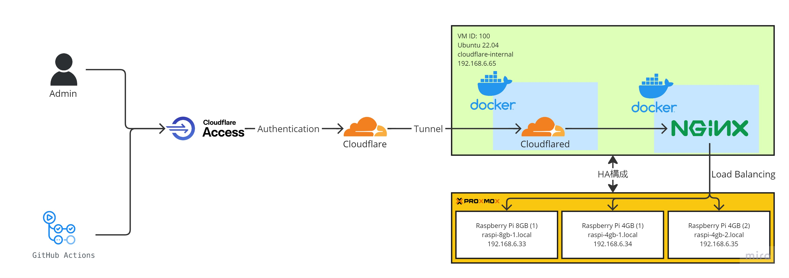

# Proxmox Cloudflare Tunnel Setup

このインスタンスは管理目的で使用するためコード管理しません。よって手動で作成します。

## サービスの仕様

このサービスは Cloudflare Tunnel を用いることで、本来内部向けのサービスを外に公開するために使用します。

管理目的のため、セキュリティと冗長性が重視されます。

よって以下の仕様とします。

[構成図](https://miro.com/app/board/uXjVOnZ07F0=/?moveToWidget=3458764559945244700&cot=14)



- 利用者は管理ユーザーとGithubActionを想定。
- このサービスは外部に直接公開せず、Cloudflare のサーバーから Cloudflare Tunnel を経由して公開する。
  - 以下のドメインを公開する。
    - Proxmox 用: `proxmox.micmnis.net`
    - NAS 用: `nas.micmnis.net`
  - これらのドメインには Cloudflare によるアクセス制御を実装し、以下の認証要素を備える。
    - micmnis.net の Google Workspace を Identity Provider とした SAML2.0 によるシングルサインオン認証。
    - Cloudflare Service Token を用いたトークン認証
- このインスタンスは HA 構成とし、稼働しているノードが停止しても他のノードにライブマイグレーションできるようにする。
  - そのために、ストレージは NAS に展開とする。
- 本サービスでは以下のアプリケーションを稼働させる
  - `cloudflared`: Cloudflare とトンネリングを担う。
  - `nginx`: Cloudflare Tunnel から送られたリクエストを各サーバーに振り分けるリバースプロキシ、およびロードバランサーを担う
    - Proxmox はいずれかのノードが停止している可能性を踏まえて、すべてのサーバーに向けて IP ハッシュ方式でロードバランシングする。

## LXC の起動

ダッシュボード右上の「CTを作成」をクリックします。

作成ウィンドウが立ち上がるので、以下の通りに入力します。指定ないものはデフォルト値のままにします。

|カテゴリー|項目|値|
|---|---|---|
|全般|ノード|VM を設置したいノード|
|全般|VM ID|デフォルトのまま|
|全般|名前|`cloudflare-internal-1`|
|全般|非特権コンテナ|`off`|
|全般|パスワード|root パスワード。1Password に保管|
|テンプレート|ストレージ|[linux_container_initialize](./documents/guest_os/linux_container/linux_container_initialize/README.md) でテンプレートを保存したストレージ|
|テンプレート|テンプレート|[linux_container_initialize](./documents/guest_os/linux_container/linux_container_initialize/README.md) で保存したテンプレート|
|ディスク|ストレージ|NAS を選択|
|ディスク|ディスクサイズ|`8GB`|
|CPU|コア|`1`|
|メモリ|メモリ(MiB)|`256`|
|メモリ|スワップ(MiB)|`0`|
|ネットワーク|IPv4/CIDR|`192.168.6.65/24`|
|ネットワーク|ゲートウェイ(IPv4)|`192.168.6.1`|
|DNS|DNSサーバ|`192.168.2.1`|

インスタンスが作成できたら、「開始」をクリックして起動します。

その後、オプションより `ブート時に起動` および `保護` をそれぞれ `はい` に設定し、ノードが再起動した時に自動で稼働 & 誤って削除されないようにします。

## スクリプト起動のための準備

次のコマンドを実行して docker をインストールします。

```sh
sudo apt update
sudo apt-get install -y curl
```

## Cloudflare Tunnel の準備

Cloudflare Zero Trust をセットアップします。

セットアップが終わったら、[公式リファレンス](https://developers.cloudflare.com/cloudflare-one/connections/connect-networks/install-and-setup/tunnel-guide/remote/)を参考に手順を進めます。

ダッシュボードの Access → Tunnels から新規作成し、名称を `micmnis.net Internal Service` にします。

それぞれの環境ごとのインストールコマンドに Token が表示されているので、それをコピーします。

## 環境のインストール

以下のコマンドを実行します。`<token>` の箇所は先の手順で入手した Cloudflare Tunnel の Token に置き換えます。

```sh
sudo -s
curl https://raw.githubusercontent.com/shimosyan/raspberry-pi-cluster/master/scripts/setup-cloudflare-internal.sh > setup-cloudflare-internal.sh
chmod +x setup-cloudflare-internal.sh
./setup-cloudflare-internal.sh <token>
```

## Cloudflare Tunnel の設定

インストールコマンドが成功すると、Cloudflare に自動認識されるので次のページに進みます。

ホストの設定に入るので次のように設定します。

- Public hostname
  - Subdomain: `proxmox` (無料プランではネストしたサブドメインは使用できません。)
  - Domain: `micmnis.net`
  - Path: 空白でOK
- Service
  - Type: `HTTP`
  - URL: `192.168.6.65:80`

ここまで入力できたら「Save Tunnel」をクリックします。

これで外部から Proxmox サーバーにアクセスできるようになっているはずです。

次に NAS 向けの設定を追加します。

Tunnel の設定を開くと、ホストの追加ができるため次のように登録します。

- Public hostname
  - Subdomain: `nas` (無料プランではネストしたサブドメインは使用できません。)
  - Domain: `micmnis.net`
  - Path: 空白でOK
- Service
  - Type: `HTTP`
  - URL: `192.168.6.65:81`

加えて、Access 機能を使って認証しないと接続できないようにします。

## Cloudflare Access の設定

### SSO の設定

Cloudflare Zero Trust のダッシュボードの Setting → Authentication から「SAML」新規作成します。

名称は `Google Workspace (micmnis.net)` にします。

次に Google Workspace の管理画面を開き、セキュリティ → 認証 → 「SAML ID プロバイダ（IdP）として Google を使用したシングル サインオン（SSO）の設定」を開きます。

ページ下部に「メタデータをダウンロード」とあるのでそこから XML ファイルを入手し、Cloudflare の SAML 設定画面にアップロードします。

これで Cloudflare 側の設定は完了です。

つづいて、Google Workspace の設定をおこないます。

Google Workspace の管理画面から アプリ → ウェブアプリとモバイルアプリ を開いて、「SAML カスタムアプリの追加」を選んで新規アプリを追加します。

パラメーターは以下の通りに入力します。

- ACS URL: `https://micmnis.cloudflareaccess.com/cdn-cgi/access/callback`
- Entity ID: `https://micmnis.cloudflareaccess.com/cdn-cgi/access/callback`
- Name ID Format: `email`

これで SSO の設定は完了です。

### Service Token の設定

Github Action で使用する Service Token を作成します。

Cloudflare Zero Trust のダッシュボードの Access → Service Auth から新規 Service Tokens を作成します。

名称、期限はお好みで指定します。

すると、アクセス ID とシークレットキーが生成されるので 1Password に保管します。

### Cloudflare Access の導入

Cloudflare Zero Trust のダッシュボードの Access → Application から新規 Application を作成します。

アプリケーションタイプを選択させられるので今回は「Self-hosted」を選択します。

名称は `micmnis.net Internal Service` にし、セッション期間はお好みにします。

`Application domain` には Cloudflare Tunnel で使用したすべてのドメインを指定します。

`Policies` では次の2つを作成します。

- Policies 1
  - Policy name: `Single-Sign ON`
  - Action: `Allow`
  - Session duration: デフォルトのまま
  - Configure rules
    - Include 1
      - Selector: `Login Method`
      - Value: `SAML - Google Workspace (micmnis.net)`
  - それ以外: デフォルトのまま
- Policies 2
  - Policy name: `Github Action`
  - Action: `Service Token`
  - Session duration: デフォルトのまま
  - Configure rules
    - Include 1
      - Selector: `Service Token`
      - Value: 追加した Service Token 名
  - それ以外: デフォルトのまま

Cloudflare Access の作成ができたら、次は Cloudflare Tunnel の設定を開きます。

設定したホストの設定画面を開いて、下にある「Access」を有効にし、Cloudflare Access の設定を指定します。

これをすべてのホストに実施します。

## 参考資料

- <https://qiita.com/honahuku/items/5b7ef71d3b59c4649948>
- <https://zenn.dev/come25136/articles/0952afd78e4922>
